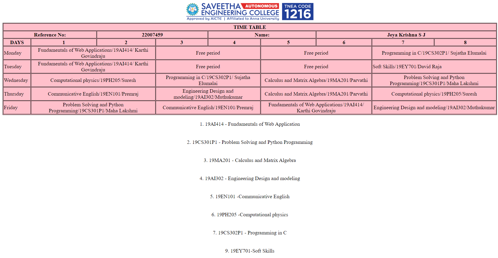

# Experiment_Time_Table

## AIM
To Write a html webpage page to display your timetable.

# ALGORITHM
### STEP 1
create a simple table using table tag
### STEP 2
Add header row using th tag
### STEP 3
Add your timetable
### STEP 4
Execute the program

# CODE
```
<!DOCTYPE html>
<html>

   <head>
      <title>TIME TABLE</title>
   </head>

   <body>
	<center></img></center>
      <table border = "1" cellspacing="1" bordercolor="black" bgcolor="pink">
         <tr>
	     	
            <th colspan="9">TIME TABLE</th>

         </tr>
	<tr>
		<th colspan="2">Reference No:</th>
        	<th colspan="2">22007459</th>
		<th colspan="2">Name:</th>
		<th colspan="3">Jeya Krishna S J</th>
	</tr>
         <tr>
            <th>DAYS</th>
            <th>1</th>
            <th>2</th>
            <th>3</th>
            <th>4</th>
            <th>5</th>
            <th>6</th>
            <th>7</th>
            <th>8</th>
           
         </tr>
<tr>
             <td>Monday</td>
             <td colspan="2"><center>Fundamentals of Web Applications/19AI414/ Karthi Govindraju</center></td>
             <td colspan="2"><center>Free period</center></td>
             <td colspan="2"><center>Free period</center></td>
             <td colspan="2"><center>Programming in C/19CS302P1/ Sujatha Elumalai</center></td>
</tr>
<tr>
             <td>Tuesday</td>
             <td colspan="2"><center>Fundamentals of Web Applications/19AI414/ Karthi Govindraju</center></td>
             <td colspan="2"><center>Free period</center></td></center>
             <td colspan="2"><center>Free period</center></td></center>
             <td colspan="2"<center>Soft Skills/19EY701/David Raja</center></td>
</tr>
<tr>
             <td>Wednesday</td>
             <td colspan="2"><center>Computational physics/19PH205/Suresh</center></td>
             <td colspan="2"><center>Programming in C/19CS302P1/ Sujatha Elumalai</center></td>
             <td colspan="2"><center>Calculus and Matrix Algebra/19MA201/Parvathi</center></td>
             <td colspan="2"><center>Problem Solving and Python Programming/19CS301P1/Maha Lakshmi </center></td>
</tr>
  <tr>
             <td>Thursday</td>
             <td colspan="2"><center>Communicative English/19EN101/Premraj</center></td>
             <td colspan="2"><center>Engineering Design and modeling/19AI302/Muthukumar</center></td>
             <td colspan="2"><center>Calculus and Matrix Algebra/19MA201/Parvathi</center></td>
             <td colspan="2"><center>Computational physics/19PH205/Suresh</center></td></center>
</tr>
<tr>
             <td>Friday</td>
             <td colspan="2"><center>Problem Solving and Python Programming/19CS301P1/Maha Lakshmi</center></td>
             <td colspan="2"><center>Communicative English/19EN101/Premraj</center></td>
             <td colspan="2"><center>Fundamentals of Web Applications/19AI414/ Karthi Govindraju</center></td>
             <td colspan="2"><center>Engineering Design and modeling/19AI302/Muthukumar</center></td>
</tr>
  </table>
    <br><center>1. 19AI414 - Fundamentals of Web Application</center></br>
    <br><center>2. 19CS301P1 - Problem Solving and Python Programming</center></br>
    <br><center>3. 19MA201 - Calculus and Matrix Algebra</center></br>
    <br><center>4. 19AI302 - Engineering Design and modeling</center></br>
    <br><center>5. 19EN101 -Communicative English</center></br>
    <br><center>6. 19PH205 -Computational physics</center></br>
    <br><center>7. 19CS302P1 - Programming in C</center></br>
    <br><center>9. 19EY701-Soft Skills</center></br>
      
     
   </body>
</html
```


# OUPUT


# Result
The program for creating time table is completed successfully

